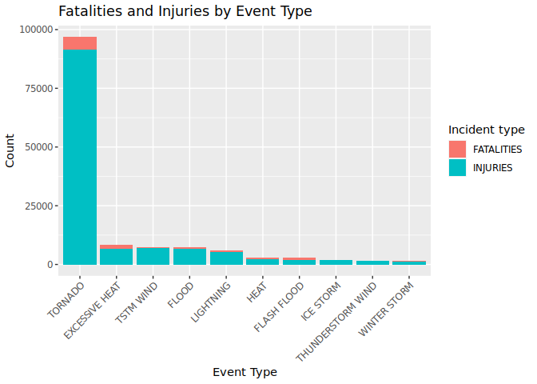
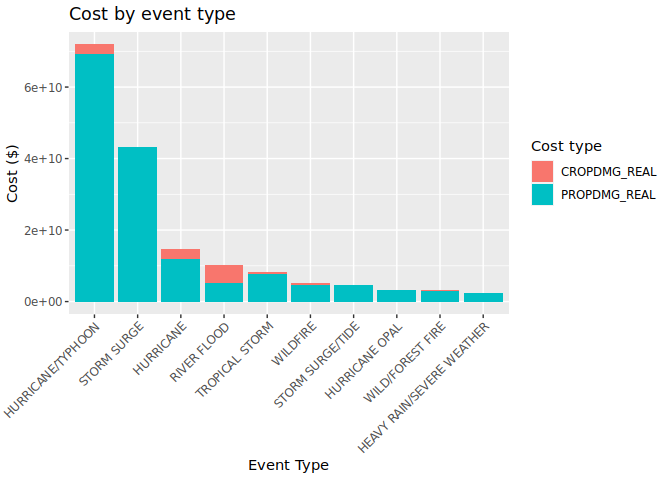

Write a synopsis here

## Data Processing
Download file and read it using data.table fast read

```r
dir.create("data", showWarnings = FALSE)
if (!file.exists("data/StormData.csv.bz2")) {
  download.file("https://d396qusza40orc.cloudfront.net/repdata%2Fdata%2FStormData.csv.bz2", "data/StormData.csv.bz2")
}
data <- fread("data/StormData.csv.bz2")
```

## Results

### Question 1: Which types of events are most harmful to population health?

To answer this question I have created a bar chart showing the combined count of fatalities and injuries caused by each event type. From this we can see that tornados far and away cause the most harm to people. Behind this, excessive heat, tstm wind, flood, and lightning are all grouped closely together, with all other event types trailing behind this.


```r
melted <- melt(data, id.vars="EVTYPE", measure.vars = c("FATALITIES", "INJURIES"))
melted <- melted[, .(count=sum(value)), by=.(EVTYPE, variable)]

top_x <- melted[, .(total=sum(count)), by=EVTYPE][order(-total)][1:10]

filtered <- melted[EVTYPE %in% top_x$EVTYPE]
# ggplot uses factor levels to order the x-axis, so we need to set the levels
filtered$EVTYPE <- factor(filtered$EVTYPE, levels=unique(top_x$EVTYPE))

ggplot(filtered, aes(EVTYPE, count, fill=variable)) +
    geom_bar(stat="identity", position="stack") +
    labs(x = "Event Type",
         y = "Count",
         fill = "Incident type",
         title = "Fatalities and Injuries by Event Type") +
    theme(axis.text.x = element_text(angle=45, hjust=1))
```

<!-- -->

### Question 2: Which type of events have the greatest economic consequence?
First we need to convert the PROPDMG/PROPDMGEXP and CROPDMG/CROPDMGEXP columns into new columns containing the real dollar amount.
Other values than K/M/B (thousands, millions, billions) exist for EXP columns, but it is unclear what they mean, so these rows have been ignored.

```r
multiplier_mapping <- c("k" = 1e3, "m" = 1e6, "b" = 1e9)
data[, PROPDMG_REAL := PROPDMG * ifelse(PROPDMGEXP == "",
                                        1,
                                        multiplier_mapping[tolower(PROPDMGEXP)])]
data[, CROPDMG_REAL := CROPDMG * ifelse(CROPDMGEXP == "",
                                        1,
                                        multiplier_mapping[tolower(CROPDMGEXP)])]
```
We can then perform the same plotting method as injuries/fatalities to find the types of storms that cause the most damages in terms of dollars.


```r
melted <- melt(data, id.vars="EVTYPE", measure.vars = c("CROPDMG_REAL", "PROPDMG_REAL"))
melted <- melted[, .(cost=sum(value)), by=.(EVTYPE, variable)]

top_x <- melted[, .(total=sum(cost)), by=EVTYPE][order(-total)][1:10]

filtered <- melted[EVTYPE %in% top_x$EVTYPE]
# ggplot uses factor levels to order the x-axis, so we need to set the levels
filtered$EVTYPE <- factor(filtered$EVTYPE, levels=unique(top_x$EVTYPE))

ggplot(filtered, aes(EVTYPE, cost, fill=variable)) +
    geom_bar(stat="identity", position="stack") +
    labs(x = "Event Type",
         y = "Cost ($)",
         fill = "Cost type",
         title = "Cost by event type") +
    theme(axis.text.x = element_text(angle=45, hjust=1))
```

<!-- -->
From this chart we can see that hurricane/typhoon is the most costly storm type, followed by storm surge and hurricane.
